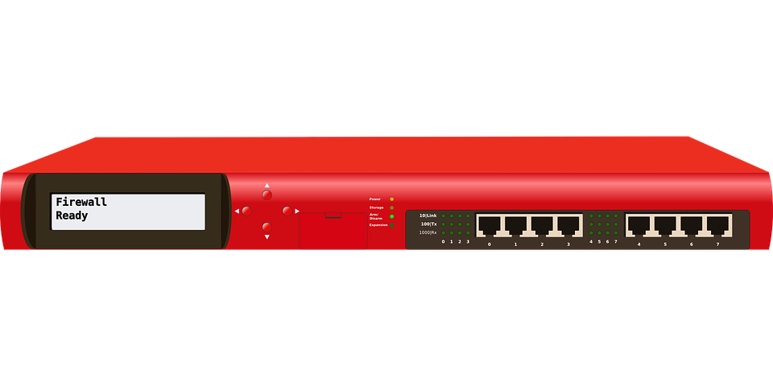

# IPExtractor for IPEX Dynamic Block List (s)
<p style="margin-left: auto;margin-right: auto;">
<b> Extract IP addresses from text files using python and create firewall IP block list </b>
</p>
<div style="margin-left: auto;
            margin-right: auto;
            width: 40%">

</div>

The number of IP block lists available for use with firewalls is huge, including among others, Spamhaus, Crowdsec, BinaryDefence BlocklistDE and DShield. This project aims to consolidate the most effective block lists. The PoC for this project was a six-month journey of exploration and I don't have feeling that it's done.

Using a block list in conjunction with firewalls is a critical strategy for enhancing network security and effectively combating malicious actors. A block list, also known as a blacklist, is a list of IP addresses, domains, or URLs that are known to be associated with malicious activity. By implementing a block list, organizations can proactively prevent access to harmful content and reduce the risk of cyber threats.

##### Why opt for IPEX DBL list rather than other available choices:

1. Our PoC demostrated that list with 15000 entries sometimes get reduced to only 7000. This means that these lists duplicate one another or utilize identical data sources. 
2. You can quickly set your firewall aliases and related policies without the usual plugin hassle.
3. The lists are updated every 6 hours if there is fresh information available from the source. This ensures that IPEX dynamic list receive the most current and relevant data.
4. This is an open source project, and the list is maintained clean, without any additional inputs (publicity) that could create problems for some firewalls.

#### Supported firewalls

Instructions for [PfSense](https://www.provya.com/blog/pfsense-opnsense-blocking-bad-risky-ip-addresses/)

Instruction for [Opensense](https://docs.opnsense.org/manual/how-tos/edrop.html)

Instruction for [Fortigate](https://docs.fortinet.com/document/fortigate/7.2.4/administration-guide/891236/ip-address-threat-feed)

`` Use 'RAW' URL (ipexdbl.txt) from this repository for seamless integration with your firewall. ``

#### ipexdbl.txt extracted from :

1. Spamhaus
2. BinaryDefense
3. DShield
4. Crowdsec
5. Bruteforce
6. Talos
7. BlocklistDE
8. HoneypotProject
9. SSLBL Botnet C2 IP Blacklist

#### ipexdbl_simple.txt extracted from:
1. Spamhaus

#### TO DO LIST
- [x] Host full HPP mirror
- [x] Add SSLBL Botnet C2 IP Blacklist list
- [x] Add projecthoneypot.org RSS feed (beta)
- [x] Instuction for firewalls (listed above), if someone have instructions for other firewalls, please open issue
- [x] Better README
- [x] Add CrowdSec private mirror
- [x] Add Talos block list
- [ ] Host block list(s) mirror(s): We are in Alfa stage, don't use "MIRRORS" script at all.
- [x] Create web home for this repository (ipex.something.x) (not hosted yet, simple html finished)
- [x] GitHub Actions: block run if errors are detected
- [x] Merge updated list(s) after running GitHub Actions
- [x] Python: don't stop updating list(s) if source is sending error 400
- [ ] IPEX is inbound traffic dynamic block list, but outbound DBL can exist as well (PoC and more information are needed)

### Repo layout
```
ipextractor
├── ipexdbl.py
├── ipexdbl_simple.py
├── ipexdbl_simple.txt
├── ipexdbl.txt
├── LICENSE
├── mirrors
│   └── honeypotproject.py
├── README.md
└── website
    ├── CHANGELOG.md
    ├── docker-compose.yml
    ├── images
    │   └── ipextractor.png
    ├── index.html
    └── README-Docker.md
```
