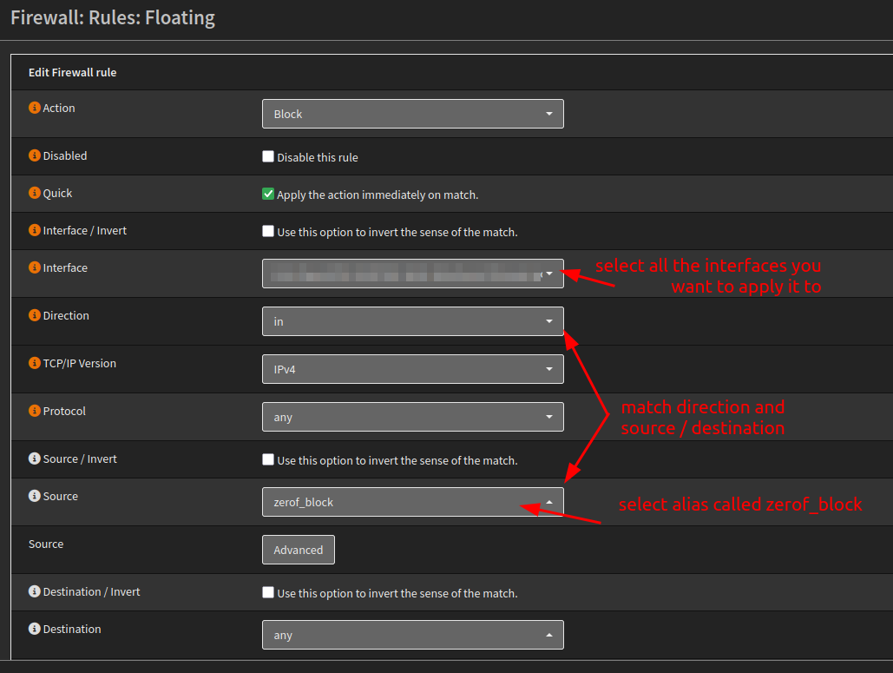

First things first, go to official project page https://ipex.root.rodeo, and find the raw link for file [ipexdbl.txt](https://raw.githubusercontent.com/ZEROF/ipextractor/main/ipexdbl.txt) which contains DBL IP's.

Next, go to the Firewall Aliases in OPNsense, and add a new one :

In this case, we select type "URL Table (IPs)", we'll name it zerof_block (fir name to your needs) to facilitate creating firewall rules, and add 1 day refresh frequency :

You can change refresh rate down to 4 hours, but daily update for Ipex DBL is good start point.

Once we have everything set, we must set new "Firewall Rule", users prefer to use Floating Rule set as it will apply to all the interfaces, and add a new one :

For internet facing systems, block inbound traffic :

For troubleshooting and logging, we can also tag the packets:

Live Log view using tag filter:

Instruction provided by @Sharkey