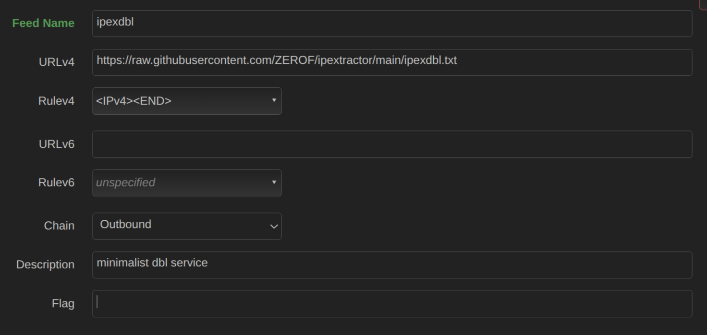
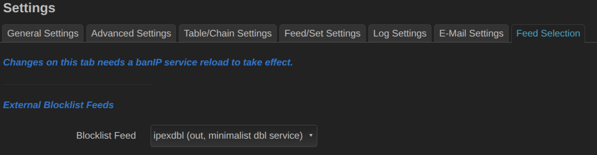

###  OpenWrt guide

https://ipex.root.rodeo provides the path to the blocklist [ipexdbl.txt](https://raw.githubusercontent.com/ZEROF/ipextractor/main/ipexdbl.txt) which contains one IP per line.

#### Install banip

```bash
opkg update
opkg install banip luci-app-banip
cp /etc/banip/banip.feeds /etc/banip/banip.custom.feeds
uci set banip.global.ban_enabled="1"
uci commit banip
service banip restart
```

#### Configure banip

[Direct download]([https://raw.githubusercontent.com/openwrt/packages/66c0da125411f50265fd178f9ff836142d67be84/net/banip/files/banip.feeds) of ``banip.feeds`` featuring ipexdbl. You can save this as ``banip.custom.feeds``

##### CLI

```curl -o /etc/banip/banip.custom.feeds https://raw.githubusercontent.com/openwrt/packages/66c0da125411f50265fd178f9ff836142d67be84/net/banip/files/banip.feeds```

##### /etc/config/banip
```
...
option ban_enabled '1'
...
list ban_feed 'ipexdbl'
```

```
service banip restart
```

##### LuCI

Go to https://openwrt-ip/cgi-bin/luci/admin/services/banip/feeds and add the following after the last "Outbound" feed ("hagezi"):




Under https://openwrt-ip/cgi-bin/luci/admin/services/banip/overview choose "Feed Selection" and pick ipexdbl as the Blocklist Feed as shown:




Hit **Save & Restart**.

More info on banip:
* https://openwrt.org/docs/guide-user/services/banip
* **Pull request regarding upstream integration [openwrt/packages#27673](https://github.com/openwrt/packages/pull/27673)**

#### Verify

```
nft list table inet banIP
```
