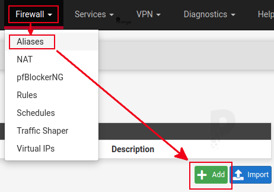
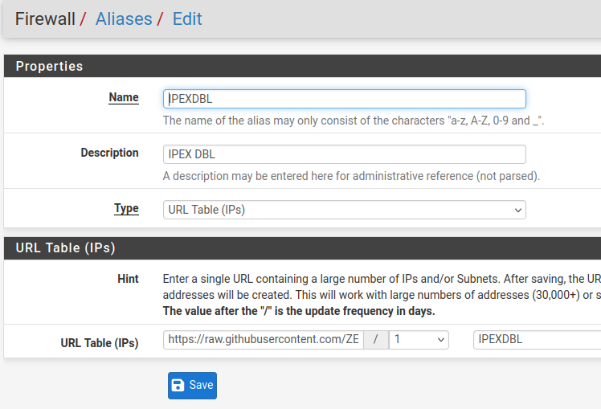
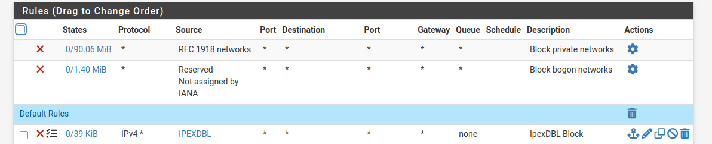
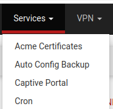
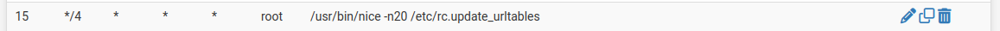
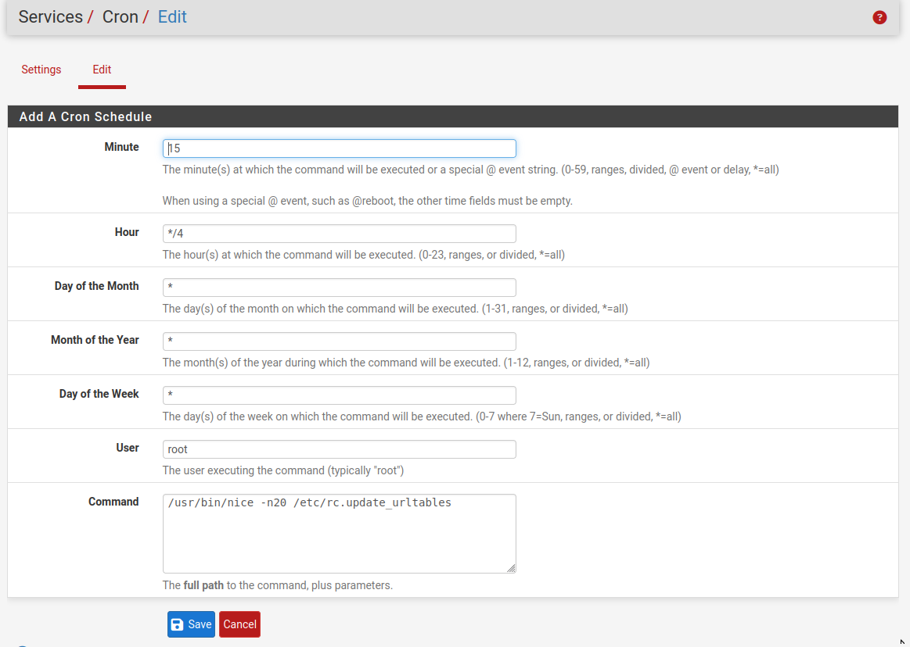
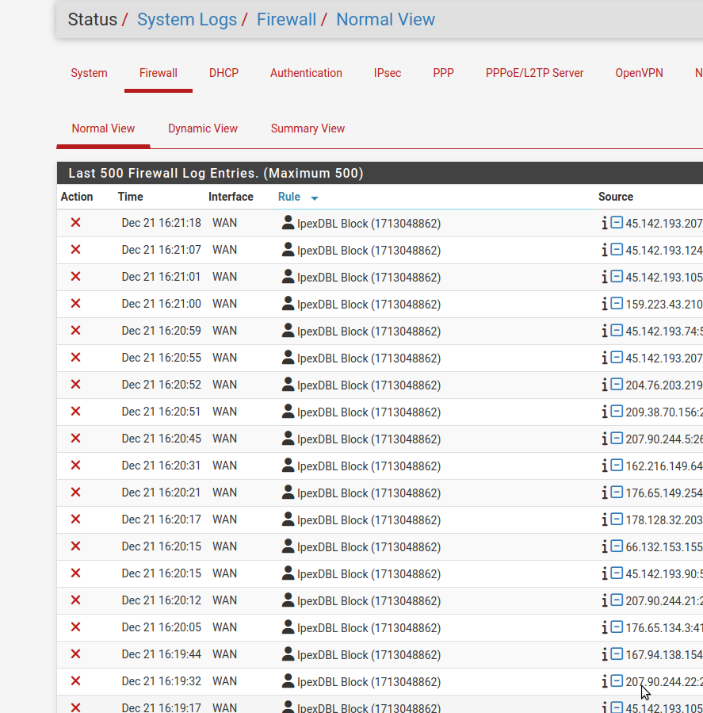

## PfSense Instructions

On the project page https://ipex.root.rodeo, we can find the raw link for file *ipexdbl.txt* which contains Ipex DBL IP's.

Next, go to the Firewall Aliases in PfSense, and add a new one :

In the next step we give name to alias, short description and very important we chose the type: URL Table. And we add URL with IPEX DBL ip's.

Save this configuration and move to the next step. Setting firewall rule.

Configure the rule with the following settings:

Action: Block
Protocol: IPv4
Source: “Single host or alias” and enter the name of the alias created in the previous step (IPEXDBL)
Destination: any​

This rule must be on the top of your rules. And we checked "Log" option to be able to see blocked IP's in the firewall logs.

By default, pfSense updates URL rules every 24 hours, while IPEX DBL updates every 4 hours. To align schedules, install the pfSense "Cron" package and make the following small modification in the cron settings:

Edit cron job to fit settings:

Save settings and you are ready to watch blocked traffic in PfSense logs:

